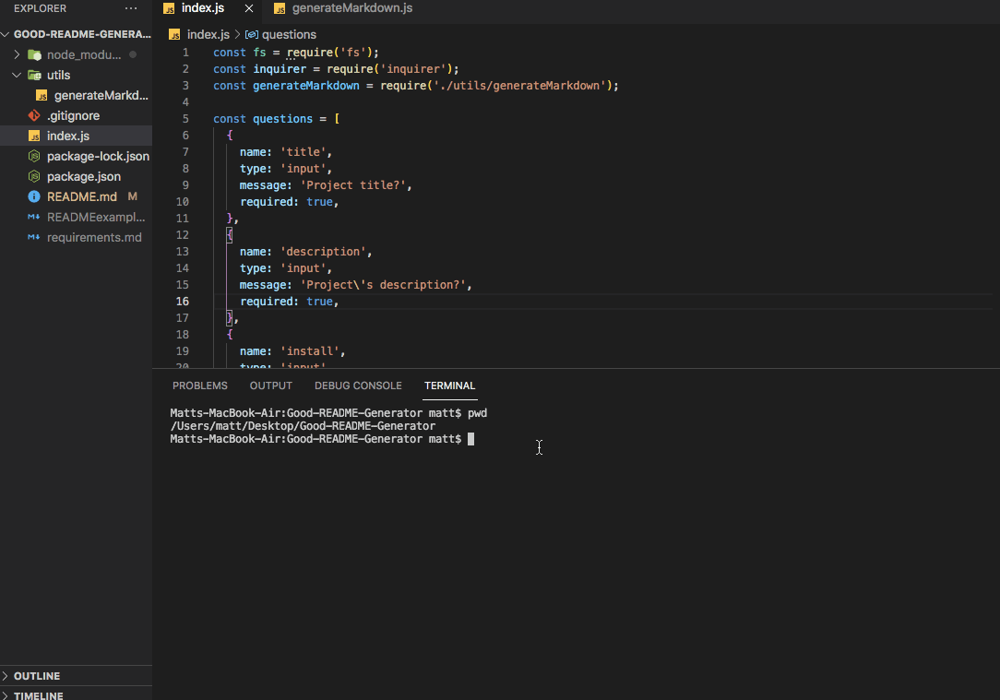
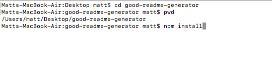

# Good Readme Generator

[](https://opensource.org/licenses/MIT)

This is an application that will generate a README.md file based on parameters provided by the user. The README features a title, a license badge, installation instructions, a questions section, and more. If the user chooses "NO LICENSE," no license information is shown. All other fields are required.



## Getting Started

In order to get started, download/clone the repository's contents do your computer, then navigate to the root directory ("good-README-generator").

### Prerequisites

You will need Node.js in order to run this application: Download it [here](https://nodejs.org/en/).

### Installing

You will need to install the "inquirer" and "axios" modules as dependencies for this app.

In terminal within the root directory:
```
npm install
```



## Built With

* [NodeJS](https://nodejs.org/en/)
* [GitHub API](https://docs.github.com/en/rest/reference/licenses)(for list of licenses)
* [Badge Generator from Michael Currin](https://michaelcurrin.github.io/badge-generator/#/generic)

## Author

**Matt Stephens** 

- [Link to Portfolio Site](https://mstephen19.github.io/newestPortfolio)
- [Link to Github](https://github.com/mstephen19)
- [Link to LinkedIn](https://www.linkedin.com/mstephen19)

## License

This project is licensed under the MIT License

## Acknowledgments

* Shoutout to [Jesse Lewis](https://www.linkedin.com/in/jesseaustinlewis/) for helping me out with prompt
